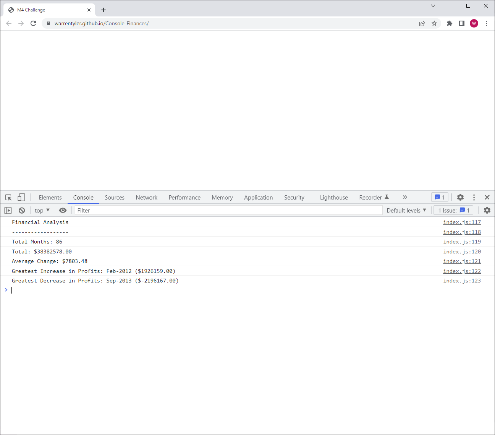

# Console Finances

## Description

This is a JavaScript console application for analysing the finacial records of a company. Created for the purposes of using the JavaScript concepts learnt for bootcamp students.

## Installation

N/A

## Usage

This appliction uses the console to log the required output. To view the output you must open the developer tools console window.

View deployed application: 
[Console Finances](https://warrentyler.github.io/Console-Finances/)
## Credits

N/A

## License

N/A.

